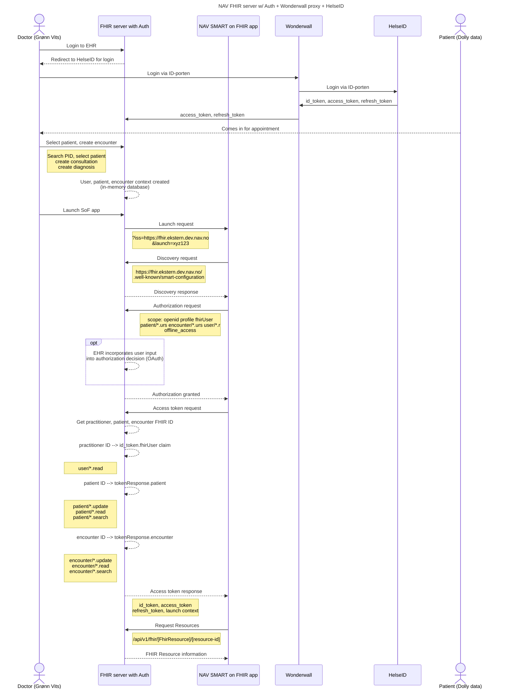

# NAV FHIR Server

## Context

TODO

## Requirements

TODO

## Description

```mermaid
---
title: NAV FHIR server w/ Auth + Wonderwall proxy + HelseID
---
sequenceDiagram
    actor DOC as Doctor (Grønn Vits)
    participant FHIR as FHIR server with Auth
    participant NAV as NAV SMART on FHIR app
    participant WALL as Wonderwall
    participant HID as HelseID
    actor PAT as Patient (Dolly data)

    DOC ->> FHIR: Login to EHR
    FHIR -->> DOC: Redirect to HelseID for login
    DOC ->> WALL: Login via ID-porten
    WALL ->> HID: Login via ID-porten
    HID ->> WALL: id_token, access_token, refresh_token
    WALL ->> FHIR: access_token, refresh_token
    PAT -->> DOC: Comes in for appointment
    DOC ->> FHIR: Select patient, create encounter
    Note right of DOC: Search PID, select patient<br>create consultation<br>create diagnosis
    FHIR -->> FHIR: User, patient, encounter context created<br>(in-memory database)
    DOC ->> FHIR: Launch SoF app
    FHIR ->> NAV: Launch request
    Note right of FHIR: ?iss=https://fhir.ekstern.dev.nav.no<br>&launch=xyz123
    NAV ->> FHIR: Discovery request
    Note right of FHIR: https://fhir.ekstern.dev.nav.no/<br>.well-known/smart-configuration
    FHIR -->> NAV: Discovery response
    NAV ->> FHIR: Authorization request
    note left of NAV: scope: openid profile fhirUser<br>patient/*.urs encounter/*.urs user/*.r<br>offline_access
    opt
        FHIR -->> FHIR: EHR incorporates user input<br>into authorization decision (OAuth)
    end
    FHIR -->> NAV: Authorization granted
    NAV ->> FHIR: Access token request
    FHIR -->> FHIR: Get practitioner, patient, encounter FHIR ID
    FHIR -->> FHIR: practitioner ID --> id_token.fhirUser claim
    Note left of FHIR: user/*.read
    FHIR -->> FHIR: patient ID --> tokenResponse.patient
    Note left of FHIR: patient/*.update<br>patient/*.read<br>patient/*.search<br>
    FHIR -->> FHIR: encounter ID --> tokenResponse.encounter
    Note left of FHIR: encounter/*.update<br>encounter/*.read<br>encounter/*.search<br>
    FHIR -->> NAV: Access token response
    Note right of FHIR: id_token, access_token<br>refresh_token, launch context
    NAV ->> FHIR: Request Resources
    Note left of NAV: /api/v1/fhir/[FhirResource]/[resource-id]
    FHIR -->> NAV: FHIR Resource information
```