# NAV FHIR Server

## Context

TODO

## Requirements

TODO

## Description

### Good to know

**1. Does the auth server get FHIR data from the FHIR server before returning a token response?**

> The authorization server typically gets context from the EHR during the initial launch. It does not directly query the FHIR server for launch context but may reference existing context stored in the EHR. For example, if the doctor is treating a specific patient, this patient ID can be included in the token response under launch or patient parameters.

**2. Does the auth server respond to the SMART app via the FHIR server, which adds context?**
> No. The FHIR server does not add context to the token response. The token response comes directly from the authorization server to the SMART app. The SMART app subsequently uses the token to query the FHIR server.

Here is a mermaid chart explaining the entire flow

```mermaid
---
title: NAV FHIR server w/ Auth + Wonderwall proxy + HelseID
---
sequenceDiagram
    actor DOC as Doctor (Grønn Vits)
    participant EHR as EHR system
    participant AUTH as Auth server
    participant FHIR as FHIR server
    participant NAV as NAV SMART on FHIR app
    participant WALL as Wonderwall
    participant HID as HelseID
    actor PAT as Patient (Dolly data)
    
    opt predondition 
        NAV ->> EHR: Register client
        EHR -->> AUTH: Client registered
    end
    DOC ->> EHR: Login to EHR
    EHR -->> AUTH:  Authorization requested
    AUTH -->> DOC: Redirect to HelseID for login
    DOC ->> WALL: Login via ID-porten
    WALL ->> HID: Login via ID-porten
    HID ->> WALL: id_token, access_token, refresh_token
    WALL -->> AUTH: id_token, access_token, refresh_token
    AUTH -->> EHR:  Authorization granted
    EHR -->> FHIR:  Get user data (FHIR)
    PAT -->> DOC: Comes in for appointment
    DOC ->> EHR: Select patient, create encounter
    Note right of DOC: Search PID, select patient<br>create consultation<br>create diagnosis
    EHR ->> FHIR: Create encounter
    EHR ->> FHIR: Get patient data
    FHIR -->> EHR: Encounter and Patient data (FHIR)
    DOC ->> EHR: Launch SoF app
    EHR ->> NAV: Launch request
    Note right of FHIR: ?iss=https://fhir.ekstern.dev.nav.no<br>&launch=xyz123
    NAV ->> FHIR: Discovery request
    Note right of FHIR: https://fhir.ekstern.dev.nav.no/<br>.well-known/smart-configuration
    FHIR -->> NAV: Discovery response
    NAV ->> AUTH: Authorization request
    note left of NAV: scope: openid profile fhirUser<br>patient/*.urs encounter/*.urs user/*.r<br>offline_access
    opt
        AUTH -->> AUTH: EHR incorporates user input<br>into authorization decision (OAuth)
    end
    AUTH -->> NAV: Authorization granted
    NAV ->> AUTH: Access token request
    AUTH -->> EHR: Get practitioner, patient, encounter FHIR from session context
    EHR -->> AUTH: practitioner ID --> id_token.fhirUser claim
    Note left of AUTH: user/*.read
    EHR -->> AUTH: patient ID --> tokenResponse.patient
    Note left of AUTH: patient/*.update<br>patient/*.read<br>patient/*.search<br>
    EHR -->> AUTH: encounter ID --> tokenResponse.encounter
    Note left of AUTH: encounter/*.update<br>encounter/*.read<br>encounter/*.search<br>
    AUTH -->> NAV: Access token response
    Note right of FHIR: id_token, access_token<br>refresh_token, launch context
    NAV ->> FHIR: Request Resources
    Note left of NAV: /api/v1/fhir/[FhirResource]/[resource-id]
    FHIR -->> NAV: FHIR Resource information
```

